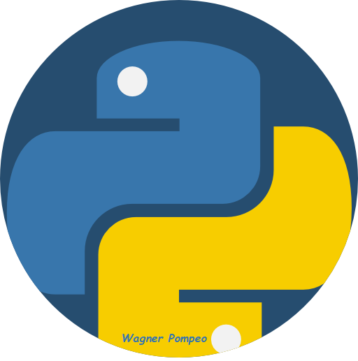

# PythonDoZero
Estudo de programação python.

  

# Wagner Pompeo
*Iniciei minha carreira no ramo da indústria como estagiário em mecatrônica. Após me formar, passei para o cargo de técnico. Trabalhei por 2 anos com manutenção de aparelhos eletrônicos, depois migrei para a função de calibração e manutenção de hardwares de testes e desde 2012, trabalho com desenvolvimento de softwares de testes em C++. O mundo do software me fez migrar da Engenharia elétrica para o Curso de Big data e Inteligência analítica. Usarei esse espaço para postar projetos e estudos de data science.*

**Background in:** C/C++, python, desenvolvimento de hardwares eletrônicos e descobrindo o mundo de Dados.

**Links:**
* [LinkedIn](https://www.linkedin.com/in/wpc23)

## Projetos:

---

